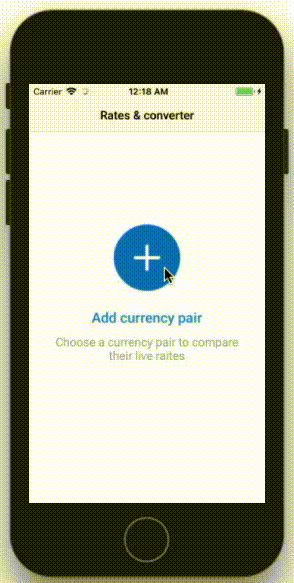

# Exchange Rates iOS

You can add exchage rate pair. 
Remove pair with slide. 

Application contains two ViewControllers. 
Exchange rates stored in Core Data.

Implemented example UITests and UnitTests.

